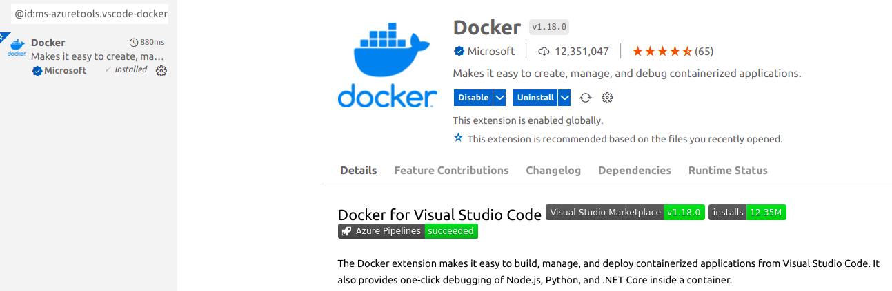

# Ungraded Lab 1

[FastAPI](https://fastapi.tiangolo.com) is another option when deploying ML models. This option is generally better when dealing with none Tensor Flow models, such as when developing a model with sklearn.

In [week 2 ungraded lab 1](https://github.com/https-deeplearning-ai/machine-learning-engineering-for-production-public/tree/main/course4/week2-ungraded-labs/C4\_W2\_Lab\_1\_FastAPI\_Docker), there is a nice tutorial on combining both FastAPI and Docker to run ML models.


Note: Extra python modules: [Pydantic](https://pydantic-docs.helpmanual.io)


The `Dockerfile` is made up of all the instructions required to build your image.

If you are working on VS Code, there is an extension for Docker files. When installed, the getting started tab will show and it can guide you through to creating your first `Dockerfile.`



Building a `Dockerfile` can be difficult at first. You can see a screenshot below of a sample breakup code:

 (1).png>)


**Note:** When I tried running the docker container, I encounter this error

<mark style="color:red;">`Error starting userland proxy: listen tcp4 0.0.0.0:80 bind: address already in use.`</mark>

This happens because I have an [Apache](https://ubuntu.com/tutorials/install-and-configure-apache#1-overview) server previously set up in the localhost port 80.

* One option to solve this issue is to stop running Apache and then try again running your container. You can find more info [here](https://www.cyberciti.biz/faq/star-stop-restart-apache2-webserver/).
* Something else that can work is to simply map port 80 to port 81 instead when running the container:

```
docker run --rm -p 81:80 mlepc4w2-ugl:no-batch
```

`Just make sure you use the right address in your web browser:`

``[`http://0.0.0.0:81/docs`](http://0.0.0.0:81/docs)``


You should see something like this:

 (1).png>)

Once the server is running you can also test it with Postman

.png>)

[Part 2](https://github.com/https-deeplearning-ai/machine-learning-engineering-for-production-public/tree/main/course4/week2-ungraded-labs/C4\_W2\_Lab\_1\_FastAPI\_Docker/with-batch) of the tutorial guides you through using FastAPI for batch inference. This time two extra imports are handled: `List` from `typing` and `conlist` from `pydantic.` Also, the main.py file is changed accordingly to deal with batch inference.


**Note**. Command to prune images

```
docker rmi $(docker images --filter "dangling=true" -q --no-trunc)
```



Same as in part 1, you can use the FastAPI built-in UI, Postman, or even use [CURL](https://blog.pair.com/2018/01/26/curl-description-basic-use-cases/) in the terminal to do your POST requests:

```
curl -X POST http://localhost:81/predict \
    -d @./wine-examples/batch_1.json \
    -H "Content-Type: application/json"
```

#### After completing the tutorial you should now:

:thumbsup: Have a better understanding of how web servers can be used to host your machine learning models.

:thumbsup: How to use FastAPI and Docker to serve ML models both for single and batching inference.

:thumbsup: Docker key concepts: image tagging, port mapping.

