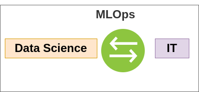

# 😁 MLOps: Introduction

#### Data Scientist vs Software Engineer

.png>)

#### Today's problems with ML/Data Science

* Models blocked before deployment
* Slow delivery to market
* Models are manually tracked
* Few or no reproducibility
* Inefficient collaboration
* Unmonitored models

**MLOps acts as a bridge between DS and IT**

.png>)

.png>)

### Levels of MLOps

Defines the level of automation and maturity of an ML team. This also will define the velocity for training and deployment of a given model.

* **Level 0**: Manual process :sob:
  * scripted and notebook driven. Most likely, there is a disconnection between DS and IT teams.
  * New model releases are less frequent
  * No CI/CD, no active model performance monitoring
*   **Level 1 and 2**

    * Rapid experimentation
    * Reusable, composable, and shareable components
    * Continuous delivery of models
    * Data validation
    * Model validation
    * Feature store (optional)
    * Metadata store

.png>)

#### TensorFLow Extended

.png>)
